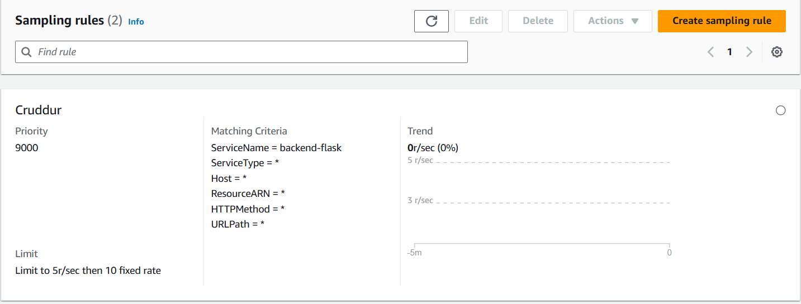

# Week 2 — Distributed Tracing

## X-Ray

### Instrument AWS X-Ray for Flask


```sh
export AWS_REGION="us-east-1"
gp env AWS_REGION="us-east-1"
```

Add to the `requirements.txt`

```py
aws-xray-sdk
```

run the requirements to get xray-sdk installed

```sh
pip install -r requirements.txt
```

Add to `app.py`

```py
from aws_xray_sdk.core import xray_recorder
from aws_xray_sdk.ext.flask.middleware import XRayMiddleware

xray_url = os.getenv("AWS_XRAY_URL")
xray_recorder.configure(service='backend-flask', dynamic_naming=xray_url)
XRayMiddleware(app, xray_recorder)
```

### Setup AWS X-Ray Resources

Add `aws/json/xray.json`

```json
{
  "SamplingRule": {
      "RuleName": "Cruddur",
      "ResourceARN": "*",
      "Priority": 9000,
      "FixedRate": 0.1,
      "ReservoirSize": 5,
      "ServiceName": "backend-flask",
      "ServiceType": "*",
      "Host": "*",
      "HTTPMethod": "*",
      "URLPath": "*",
      "Version": 1
  }
}
```

```sh
FLASK_ADDRESS="https://4567-${GITPOD_WORKSPACE_ID}.${GITPOD_WORKSPACE_CLUSTER_HOST}"
aws xray create-group \
   --group-name "Cruddur" \
   --filter-expression "service(\"backend-flask\")"
```


```sh
aws xray create-sampling-rule --cli-input-json file://aws/json/xray.json
```



